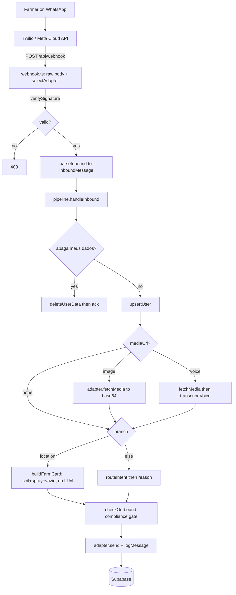

# Stevi — Architecture

How an inbound WhatsApp message becomes a grounded, compliant reply, and why the
system is shaped the way it is.

## Table of contents

- [Design constraints (read first)](#design-constraints-read-first)
- [The message loop](#the-message-loop)
- [Loop diagram](#loop-diagram)
- [Transport-adapter abstraction](#transport-adapter-abstraction)
- [The pipeline, stage by stage](#the-pipeline-stage-by-stage)
- [Intent router](#intent-router)
- [Reasoning engine](#reasoning-engine)
- [Tool layer](#tool-layer)
- [Compliance gate](#compliance-gate)
- [LLM tiers via OpenRouter](#llm-tiers-via-openrouter)
- [Data model](#data-model)
- [Stateless compute, stateful DB](#stateless-compute-stateful-db)
- [Failure philosophy](#failure-philosophy)
- [Source map](#source-map)

---

## Design constraints (read first)

Two rules shape every module. They are not features bolted on at the edges — they
are why the pipeline has the stages it has.

### Prime directive: never invent agronomy

Every agronomic claim must have a basis (EMBRAPA, Agrofit, FRAC-BR, or an
equivalent official source). When Stevi lacks a solid basis it says so honestly
and points the farmer to an agronomist. "Chutar mata lavoura" — guessing kills
crops and creates legal liability. This directive is enforced structurally, not
just by prompt:

- Pest/disease answers are **grounded** in the Agrofit registry before the model
  writes them (`api/_lib/tools/agrofit.ts`), and grounding is skipped (rather than
  faked) when nothing clears a confidence floor.
- The vazio-sanitário calendar returns **silence for an unknown state** rather
  than a guessed date (`api/_lib/tools/calendar.ts`).
- The system prompt (`api/_lib/prompts/system.ts`) carries the directive verbatim.

### The prescription boundary: triage, not prescription

In Brazil, prescribing a defensivo (specifying "apply product X at dose Y") is an
act reserved to a licensed agronomist and documented in the *receituário
agronômico* (Lei 14.785/2023; Resolução CONFEA 1.149/2025). Stevi may tell a
farmer **what is registered** for a crop/pest ("existe registro"), but never
**apply this at this dose**. This boundary is defended in depth:

1. **System prompt** instructs the model never to prescribe and to end every
   pest/disease answer by handing the product/dose decision to an agronomist.
2. **Handoff reminder** (`PEST_HANDOFF_REMINDER`) is appended for pest-triage and
   vision paths.
3. **Grounding blocks** state actives without doses and re-assert the boundary.
4. **Outbound compliance gate** (`api/_lib/compliance.ts`) is a heuristic backstop:
   if a reply combines an application instruction with a concrete dose/rate, the
   gate replaces it with a safe handoff before it reaches the farmer.

---

## The message loop

The whole product is one request/response loop. A farmer sends a WhatsApp message;
the provider (Twilio sandbox today, Meta Cloud API as the endgame) POSTs it to the
webhook; the pipeline turns it into a reply; the reply is sent back over the
provider's REST/Graph API.

1. **Ingress** — `api/webhook.ts`. Body parsing is disabled so the exact request
   bytes are available for signature verification. The handler reads the raw body,
   picks the transport adapter by request shape, verifies the signature, and parses
   the provider payload into a provider-neutral `InboundMessage`.
2. **Pipeline** — `api/_lib/pipeline.ts` (`handleInbound`). Normalizes media
   (image bytes / voice → transcript), handles the LGPD delete short-circuit,
   loads/creates the user, routes, reasons or builds a farm card, runs the
   compliance gate, sends the reply, and logs both directions.
3. **Ack** — the webhook returns the provider's expected acknowledgement (empty
   TwiML for Twilio, `200 {received:true}` for Meta). The reply itself is sent
   out-of-band via the adapter's `send()`, so the loop is uniform across providers.

The reply is always sent asynchronously (both adapters declare `isSync = false`),
which is why the webhook can ack immediately and keeps the two providers symmetric.

## Loop diagram

```
          ┌─────────────┐
          │   Farmer    │  text · photo · voice · location pin
          │  (WhatsApp) │
          └──────┬──────┘
                 │  HTTPS POST (form-enc or JSON)
                 ▼
   ┌──────────────────────────────┐
   │  Twilio sandbox / Meta Cloud  │
   └──────────────┬───────────────┘
                  │  webhook POST  (+ X-Twilio-Signature / X-Hub-Signature-256)
                  ▼
   ╔══════════════════════════════════════════════════════════╗
   ║  api/webhook.ts   (bodyParser disabled → raw bytes)        ║
   ║   1. read raw body                                         ║
   ║   2. selectAdapter(req)  ── header shape ──▶ Twilio | Cloud ║
   ║   3. adapter.verifySignature()      (403 on failure)       ║
   ║   4. adapter.parseInbound() ──▶ InboundMessage             ║
   ╚═══════════════════════════┬════════════════════════════════╝
                               │  handleInbound(adapter, msg)
                               ▼
   ╔══════════════════════════════════════════════════════════╗
   ║  api/_lib/pipeline.ts                                      ║
   ║                                                            ║
   ║  "apaga meus dados"? ─yes─▶ deleteUserData → ack → done    ║
   ║        │ no                                                ║
   ║        ▼                                                   ║
   ║  upsertUser(wa_id)  → userId, firstContact?                ║
   ║        │                                                   ║
   ║  mediaUrl? ─▶ adapter.fetchMedia()                         ║
   ║        image → base64+mime   voice → transcribeVoice()     ║
   ║        │                                                   ║
   ║  logMessage('in')                                          ║
   ║        │                                                   ║
   ║        ├─ voice w/o transcript ─▶ "resend audio" reply     ║
   ║        ├─ location ────────────▶ buildFarmCard() [no LLM]  ║
   ║        └─ else ─▶ routeIntent() ─▶ reason()                ║
   ║                        │                │                  ║
   ║                        ▼                ▼                  ║
   ║                   router.ts        reason.ts               ║
   ║                  (haiku tier)    ┌── spray → deltaT+weather║
   ║                                  ├── image → vision (sonnet)║
   ║                                  └── text → Agrofit-grounded║
   ║                                              reasoning      ║
   ║        │                                                   ║
   ║        ▼                                                   ║
   ║  checkOutbound(reply)  ── prescription shape? → safe swap  ║
   ║        │                                                   ║
   ║  (+ LGPD consent note on first contact)                    ║
   ║        │                                                   ║
   ║  adapter.send()  →  logMessage('out')                      ║
   ╚═══════════════════════════┬════════════════════════════════╝
                               ▼
                    ┌────────────────────┐        ┌──────────────────┐
                    │  Supabase (state)  │        │ External tools    │
                    │  users · farms ·   │        │ Open-Meteo (wx)   │
                    │  farm_derived ·    │        │ SoilGrids (soil)  │
                    │  messages ·        │        │ BigDataCloud (geo)│
                    │  monitor_runs      │        │ Agrofit slice(fs) │
                    └────────────────────┘        └──────────────────┘

   ── separately ──
   Vercel Cron ──daily 11:00 UTC──▶ api/cron/monitor.ts (CRON_SECRET) → monitor_runs
```

The same flow expressed as mermaid:



---

## Transport-adapter abstraction

The pipeline never knows which WhatsApp provider it is talking to. Everything
provider-specific lives behind `TransportAdapter` (`api/_lib/transport/types.ts`):

```ts
interface TransportAdapter {
  readonly provider: string;               // 'twilio' | 'cloud'
  readonly isSync: boolean;                 // both false: reply is sent out-of-band
  verifySignature(req: TransportRequest): Promise<boolean>;
  parseInbound(req: TransportRequest): Promise<InboundMessage | null>;
  send(msg: OutboundMessage): Promise<void>;
  fetchMedia?(ref: string): Promise<{ base64: string; mime: string }>;
}
```

`TransportRequest` carries the **raw body as a `Buffer`** (plus headers/url), because
both providers verify signatures over exact bytes. `InboundMessage` is the neutral
shape every provider normalizes to (`from`, `messageId`, `kind`, `text`, `mediaUrl`,
`mediaMime`, `location`, `profileName`).

Two adapters implement it:

- **`TwilioAdapter`** (`transport/twilio.ts`) — the live Stage-0 transport. Parses
  URL-encoded form bodies, validates the `X-Twilio-Signature` HMAC-SHA1, sends via
  the Twilio REST API, and fetches media with account basic-auth. It deliberately
  avoids the `twilio` SDK (its ~1000 `.d.ts` files dominated typecheck time); the
  two things needed — signature validation and send — are a few lines of
  `node:crypto` + `fetch`.
- **`CloudApiAdapter`** (`transport/cloud.ts`) — the Meta WhatsApp Cloud API
  transport (the scale/compliance endgame). Handles the GET subscription challenge,
  validates `X-Hub-Signature-256` (HMAC-SHA256 over the raw body keyed by the app
  secret), parses the Graph message envelope, resolves media ids to bytes in two
  hops, and sends via the Graph API.

`api/webhook.ts` selects the adapter by request shape: an `x-hub-signature-256`
header or a JSON content-type routes to Cloud; otherwise Twilio (the active
sandbox). Because both live at one URL, flipping from the sandbox to Meta needs no
code change — just point Meta's webhook here and provision the Meta env vars. See
[the webhook doc](../webhook/) for the full contract.

---

## The pipeline, stage by stage

`handleInbound(adapter, msg)` in `api/_lib/pipeline.ts`:

1. **LGPD delete short-circuit.** If the text matches
   `/\b(apaga|apagar|exclui|excluir|delet)\w*\s+(meus?\s+)?dados\b/i`, wipe the
   user's data and ack. Nothing else runs. This is checked before user upsert so a
   brand-new sender can still request deletion.
2. **User upsert.** `upsertUser(from, profileName)` by `wa_id`. `firstContact` is
   true when `consent_lgpd_at` is null; the row also carries the `awaiting`
   conversation-state flag.
3. **Rate limit.** Before any expensive work (media fetch, LLM),
   `countRecentInbound(userId, …)` counts the user's inbound messages in the last
   60 s. At/above **15** per minute, Stevi sends one heads-up (only exactly at the
   threshold), logs the message with `intent: 'rate_limited'`, and returns — so a
   flood or an echo loop can't become a reply storm. Fail-open: a DB error counts as
   0, so a hiccup never locks a farmer out. (Skipped when the user upsert failed.)
4. **Media normalization.** If `mediaUrl` is present and the adapter exposes
   `fetchMedia`, fetch the bytes. An image becomes a `ChatImage` (base64 + mime); a
   voice note is transcribed to text via `transcribeVoice`. Media fetch is
   fail-soft: any error is logged and the loop continues without it.
5. **Effective message.** A voice note that transcribed successfully is rewritten as
   a normal text message (`kind: 'text'`) for everything downstream.
6. **Inbound log.** `logMessage('in', …)` records kind, text, transcript, and the
   provider message id.
7. **Branch:**
   - **Crop-capture answer** — if the user was `awaiting === 'crop'` (set right after
     the farm card) and the text parses to recognizable crops (`parseCrops`,
     `api/_lib/tools/crops.ts`), persist them (`setFarmCrops`), clear the wait, and
     confirm. A non-crop reply clears the wait and falls through, so a message is
     never swallowed.
   - Voice with no transcript → a canned "didn't catch that, resend/type" reply.
   - Location pin → `buildFarmCard(...)` — deterministic, **no LLM** (see below) —
     then mark the user `awaiting = 'crop'`.
   - Otherwise → `routeIntent(...)` then `reason(...)`, with a fallback reply if
     reasoning throws.
8. **Compliance gate.** `checkOutbound(replyText)` inspects the reply; an unsafe
   (prescription-shaped) reply is swapped for a safe handoff and the flags are
   logged.
9. **First-contact consent.** On first contact the LGPD consent note is appended
   once, and `markConsentNotified` stamps `consent_lgpd_at` so it never repeats.
10. **Send + outbound log.** `adapter.send({to, text})`, then `logMessage('out', …)`.

**Conversation state.** State between messages is a single `users.awaiting` flag
(nullable text; `null` = idle), not a session object — consistent with the stateless
compute model. The only value today is `'crop'`, set by the farm card and consumed by
the crop-capture branch above.

### The farm card (onboarding payback)

`api/_lib/farmcard.ts` is the "caramba, ele conhece minha terra" moment. On a pin
drop it derives everything it can **in parallel** (`Promise.allSettled`) and
reflects it back in one WhatsApp-sized message:

- Soil from SoilGrids (cached per farm; fed through `textureLabel` and a pH/acidity
  note),
- The current Delta T spray window (`fetchHourlyWeather` → `sprayWindow` →
  `phraseSpray`),
- The state's vazio-sanitário status (reverse-geocode → UF → `vazioStatus`).

Every layer degrades independently: the card ships with whatever resolved in time
and never throws. The card closes by asking what the farmer grows; the pipeline then
sets `awaiting = 'crop'` so the next reply can be captured as crops.

---

## Intent router

`api/_lib/router.ts` classifies a text message into one path. **Structural signals
beat the LLM:** an image is always `pest_triage`, a location is always
`onboarding`. For text, a cheap-tier model classifies into one of
`pest_triage | spray_window | field_profile | general | smalltalk`. On any doubt or
error it defaults to `general` — the safe path (grounded reasoning with the handoff,
never a confident prescription). The classifier is capped at 12 output tokens and
matched by keyword substring against the valid set.

## Reasoning engine

`api/_lib/reason.ts` produces the farmer-facing reply. Two paths bypass free-form
generation entirely:

- **`spray_window`** → `handleSpray`. Needs coordinates (from the message or the
  stored farm location). Fetches 12h of weather and returns a **deterministic**
  Delta T verdict phrased by `phraseSpray` — no LLM. If no location is known it
  asks for a pin; if the weather fetch fails it returns a safe reference range.
- **`smalltalk`** → a fixed PT-BR intro string.

The LLM-backed paths:

- **Vision** (image + fetched media) → `handleVision`, a **grounded two-step**.
  First `identifyFromPhoto` asks the reasoning tier for a *structured* JSON
  identification (`pest`, `crop`, `confidence` ∈ alta/media/baixa, one-line
  `evidence`). When a pest is named with non-low confidence, it is looked up in
  Agrofit and the registry becomes the base for a second compose pass that writes the
  WhatsApp reply (honest confidence, one-line why, MIP management, what's registered
  without doses, receituário handoff). If identification fails — or is low-confidence
  with no pest — it falls back to a single direct vision answer, so a photo always
  gets a useful, safe reply.
- **Text** → `handleText`. For `pest_triage`, it first extracts `{crop, pest}` with
  the cheap tier and looks them up in Agrofit; a hit becomes a grounding block
  injected into the prompt ("use this as base, don't invent"). Any derived farm
  context is injected the same way. Then the reasoning tier answers.

## Tool layer

Deterministic capabilities live in `api/_lib/tools/`. Weather/soil/geo are thin
fetch wrappers; the agronomic logic (Delta T, calendar, Agrofit scoring) is pure and
unit-tested.

| Tool | File | Source / method | Failure mode |
|------|------|-----------------|--------------|
| **Delta T spray window** | `deltaT.ts` | Pure math: wet-bulb via Stull (2011), Delta T = dry−wet bulb, `assessHour` → go/caution/no-go using Delta T (2–8 °C good, >10 no-go), wind (>10 caution, >15 no-go), rain prob (≥40 caution, ≥70 no-go). No I/O. | n/a (pure) |
| **Weather** | `tools/weather.ts` | Open-Meteo (free, keyless): hourly temp, RH, wind (km/h), precip probability; trimmed to "now" onward. | throws → caller degrades |
| **Soil** | `tools/soil.ts` | SoilGrids (ISRIC), topsoil pH/clay/sand, 6 s timeout; `textureLabel` gives Brazilian field vocabulary. | fail-soft → `null`, cached per farm |
| **Geo** | `tools/geo.ts` | BigDataCloud reverse-geocode → Brazilian UF, 5 s timeout. | fail-soft → `null` |
| **Calendar (vazio sanitário)** | `tools/calendar.ts` | Hardcoded per-UF windows from Portaria SDA/MAPA nº 1.579/2026; `vazioStatus`, `upcomingTransitions`, `isCalendarStale`. Regional states hedge; unknown UF stays silent. | returns "unknown" rather than guess |
| **Agrofit grounding** | `tools/agrofit.ts` | Local JSON slice of the MAPA registry; `normalizeCrop`, `lookupPest` (accent/hyphen-insensitive scoring with a confidence floor of 50), `groundingBlock` (actives without doses + boundary reminder). | returns `null` below floor (never mis-ground) |

See [the knowledge-base doc](../knowledge-base/) for how the Agrofit slice and
calendar are built and refreshed.

## Compliance gate

`api/_lib/compliance.ts` — a pure, unit-tested backstop, not the primary control
(the system prompt is). `checkOutbound(text)` flags a reply as unsafe only when it
combines a **dose/rate** (e.g. `0,5 L/ha`, `500 ml por hectare`, `2 kg/ha`) with an
**application instruction or product mention** (aplique/pulverize/…, or
produto/defensivo/fungicida/…). That is the shape of a prescription. When flagged,
the reply is **replaced** — not silently dropped — with an honest handoff that still
helps the farmer. Liming advice with a number, or "existe registro para…", passes.

## LLM tiers via OpenRouter

All model calls go through one OpenRouter key (`api/_lib/llm.ts`, OpenAI-compatible
`/chat/completions` over plain `fetch`, no SDK, no streaming). Tiers are chosen by
task and configured by env (`api/_lib/env.ts`), so model versions can rotate without
code changes:

| Tier | Env var | Default slug | Used for |
|------|---------|--------------|----------|
| Router (cheap) | `ROCA_ROUTER_MODEL` | `anthropic/claude-haiku-4.5` | intent classification, `{crop,pest}` extraction |
| Reasoning (flagship) | `ROCA_REASONING_MODEL` | `anthropic/claude-sonnet-5` | grounded Q&A and vision |
| Transcribe (audio) | `ROCA_TRANSCRIBE_MODEL` | `google/gemini-2.5-flash` | PT-BR voice-note transcription |

`chat()` supports a text turn, an optional image (as a data URL), and optional audio
(`input_audio`). It throws on API failure or empty completion; callers decide whether
to degrade (router → `general`; transcription → ask for text) or surface a fallback.

## Data model

Supabase/Postgres, defined in `supabase/migrations/`. Minimal and LGPD-conscious:
store only what earns its keep. **RLS is enabled on every table with no public
policies** — all access is via the service-role key from server code, so the anon
key cannot read farmer data.

| Table | Key columns | Notes |
|-------|-------------|-------|
| `users` | `id`, `wa_id` (unique), `name`, `state` (UF), `consent_lgpd_at`, `awaiting`, `created_at` | keyed by WhatsApp id; `state` set from the farm-card reverse-geocode; `awaiting` is the conversation-state flag (migration `…_conversation_state`) |
| `farms` | `id`, `user_id` (FK, unique), `lat`, `lon`, `crop text[]`, `irrigated`, `planting_date`, timestamps | one farm per user (v1); `crop` written by crop capture; `updated_at` kept fresh by a trigger |
| `farm_derived` | `farm_id` (PK/FK), `soil_json`, `climate_normals_json`, `latest_ndvi`, `fetched_at` | slow-changing derived cache; only `soil_json` is populated today |
| `messages` | `id`, `user_id` (FK), `direction` (`in`/`out`), `kind`, `raw`, `transcript`, `intent`, `provider_message_id`, `created_at` | full conversation log; indexed by `(user_id, created_at desc)` |
| `monitor_runs` | `id`, `ran_at`, `transitions_count`, `stale`, `findings` (jsonb), `created_at` | daily-monitor audit trail |

**Columns ahead of the code (reserved):** `farms.irrigated`, `farms.planting_date`,
and `farm_derived.climate_normals_json` / `latest_ndvi` exist in the schema but are
not written by any current code path — staged for later derived layers. (`farms.crop`
and `users.awaiting` *are* written now, by crop capture.) `db.getUserState` is defined
but not yet called (only `setUserState` is, from the farm card). Noted so a reader
isn't surprised to find empty columns.

## Stateless compute, stateful DB

Each webhook invocation holds **no** state between messages. Everything durable lives
in Supabase; every message reloads the user by `wa_id` and reads any needed farm
context from the DB. This is what makes the compute layer a set of ordinary
serverless functions with no session store, no warm state to manage, and no
affinity requirements — and it is why cost scales with invocations, not uptime (see
the cost notes in [the deployment doc](../deployment/)). Derived data that is
expensive and slow-changing (soil) is cached in `farm_derived` so a reply never
blocks on a re-fetch.

## Failure philosophy

The farmer must get a useful reply or an honest one — never a crash and never a
guess. Concretely:

- **Fail-soft tools.** Soil/geo return `null` on error; weather throws but callers
  catch and fall back to a reference range or a shorter farm card.
- **Fail-soft persistence.** DB helpers log and return without throwing where a
  hiccup shouldn't block the reply.
- **Degrade, don't crash.** Router errors → `general`; transcription failure → ask
  for text; reasoning exception → a generic fallback reply.
- **Silence over invention.** Unknown UF, sub-floor Agrofit match → say nothing
  rather than assert.
- **Replace, don't drop.** A prescription-shaped reply is swapped for a safe
  handoff, so a blocked message is never a silent non-answer.
- **Mask PII in logs.** `api/_lib/logger.ts` masks phone numbers (LGPD: `wa_id` is
  personal data).

## Source map

```
api/
  webhook.ts              ingress: raw body, adapter select, verify, ack
  cron/monitor.ts         daily monitor (CRON_SECRET); vazio transitions + staleness
  _lib/
    pipeline.ts           handleInbound: the orchestrated loop
    router.ts             intent classification (+ structural fast-paths)
    reason.ts             reply generation: spray / vision / grounded text
    compliance.ts         outbound prescription gate (pure)
    llm.ts                OpenRouter chat client (text/image/audio)
    env.ts                requireEnv + MODELS tiers
    db.ts                 Supabase persistence (service role)
    logger.ts             phone-masking structured logger
    farmcard.ts           onboarding payback card (parallel derive)
    transcribe.ts         PT-BR voice-note ASR
    tools/                deltaT · weather · soil · geo · calendar · agrofit · crops
    prompts/system.ts     PT-BR system prompt + handoff reminder
    transport/
      types.ts            TransportAdapter + neutral message shapes
      twilio.ts           Twilio sandbox adapter (HMAC-SHA1)
      cloud.ts            Meta Cloud API adapter (HMAC-SHA256)
    data/agrofit.json     runtime Agrofit slice (shipped via vercel.json includeFiles)
supabase/migrations/      schema (init + monitor)
knowledge/                grounding sources (Agrofit CSV+slice, portaria text)
scripts/                  agrofit-extract, simulate-inbound, key checks, pdf extract
tests/                    vitest: deltaT, compliance, calendar, agrofit, signatures, cloud
```
